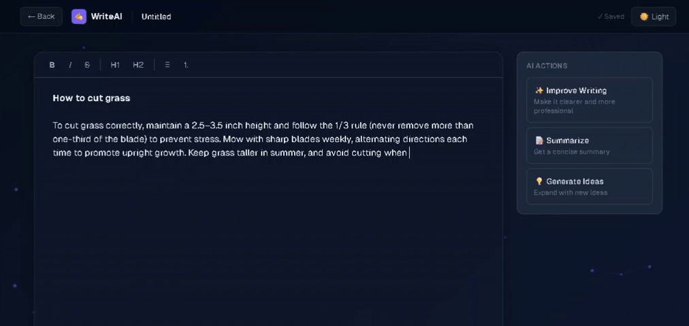

# WriteAI — AI-Powered Writing Assistant

A full-stack AI writing assistant that helps you write, improve, summarize and expand your documents using Google Gemini.



## 🌐 Live Demo
🚀 **Use the app:** 

**[https://writeai-lyart.vercel.app](https://writeai-lyart.vercel.app)**

## 🛠️ Tech Stack

**Frontend:**
- Next.js 15 + React
- TypeScript
- Tailwind CSS
- TipTap (rich text editor)
- Axios

**Backend:**
- ASP.NET Core Web API (.NET 10)
- Entity Framework Core
- PostgreSQL (Neon.tech)
- JWT Authentication
- BCrypt password hashing
- Google Gemini API (streaming)

## ✨ Features

- User authentication (register and login with JWT)
- Create, rename and delete documents
- Rich text editor with formatting toolbar (bold, italic, headings, lists)
- Autosave while typing
- AI-powered actions using Google Gemini:
- ✨ Improve Writing — rewrites text to be clearer and more professional
- 📝 Summarize — generates a concise summary
- 💡 Generate Ideas — expands content with 5 creative ideas
- Streaming AI responses
- Dark / Light mode with persistent preference
- Animated particle background
- Glassmorphism UI

## 📦 Getting Started

### Prerequisites

- .NET 10 SDK
- Node.js 18+
- PostgreSQL
- Google Gemini API key

### Backend Setup
```bash
cd WriteAI.API
```

Create your `appsettings.Development.json` file:
```json
{
  "ConnectionStrings": {
    "DefaultConnection": "Host=localhost;Port=5432;Database=writeai;Username=postgres;Password=yourpassword"
  },
  "JwtSettings": {
    "SecretKey": "your-secret-key-minimum-32-characters-long"
  },
  "GeminiSettings": {
    "ApiKey": "your-gemini-api-key"
  }
}
```

Run migrations and start the API:
```bash
dotnet ef database update
dotnet run
```

API will be available at `http://localhost:5028`

### Frontend Setup
```bash
cd writeai-web
```

Create a `.env.local` file:
```
NEXT_PUBLIC_API_URL=http://localhost:5028
```

Install dependencies and run:
```bash
npm install
npm run dev
```

Frontend will be available at `http://localhost:3000`

## 📁 Project Structure
```
WriteAI/
├── WriteAI.API/                  # .NET Backend
│   ├── Controllers/              # API endpoints
│   ├── Models/                   # Database entities
│   ├── DTOs/                     # Data transfer objects
│   ├── Services/                 # Business logic (Auth, Documents, Gemini)
│   ├── Interfaces/               # Service interfaces
│   └── Data/                     # DbContext
│
└── writeai-web/                  # Next.js Frontend
    ├── src/
    │   ├── app/                  # Pages
    │   ├── components/           # Editor and UI components
    │   ├── context/              # Auth context
    │   ├── hooks/                # useAutosave, useAI, useDarkMode
    │   ├── lib/                  # Axios configuration
    │   └── types/                # TypeScript types
```

## 📄 API Endpoints

| Method | Endpoint | Description | Auth |
|--------|----------|-------------|------|
| POST | /api/auth/register | Register user | ❌ |
| POST | /api/auth/login | Login user | ❌ |
| GET | /api/documents | List documents | ✅ |
| POST | /api/documents | Create document | ✅ |
| GET | /api/documents/{id} | Get document | ✅ |
| PATCH | /api/documents/{id}/title | Update title | ✅ |
| PATCH | /api/documents/{id}/content | Update content | ✅ |
| DELETE | /api/documents/{id} | Delete document | ✅ |
| POST | /api/ai/improve | Improve writing | ✅ |
| POST | /api/ai/summarize | Summarize text | ✅ |
| POST | /api/ai/ideas | Generate ideas | ✅ |

## 👨‍💻 Author

Made by [otavioleme](https://github.com/otavioleme)
